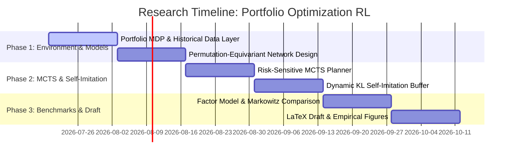

# Research Roadmap: Permutation-Equivariant Self-Imitation MCTS for Risk-Sensitive Portfolio Optimization

## 1. Project Overview & Research Objectives
This project develops a **Permutation-Equivariant Risk-Sensitive Reinforcement Learning Framework** combined with **Monte Carlo Tree Search (MCTS)** for dynamic multi-asset portfolio optimization.

### Key Innovations:
1. **Permutation-Equivariant Asset Architecture ($S_N$ Group Symmetry)**:
   Portfolio optimization problems possess intrinsic permutation symmetry: reordering the sequence of $N$ assets in the observation tensor should permute the output portfolio allocation weights identically. We utilize $S_N$-equivariant neural encoders (Deep Sets / Permutation Equivariant Layers) to achieve parameter efficiency and zero-shot asset order generalization.
2. **Risk-Sensitive MCTS Policy Improvement**:
   We extend standard MCTS value planning by incorporating **Conditional Value-at-Risk (CVaR)** and Sharpe ratio objectives directly into tree node evaluations and dynamic self-imitation regularization.
3. **Transaction-Cost & Regime-Aware Self-Imitation**:
   Historical high-Sharpe trajectory buffer expansion regularized via dynamic KL divergence to prevent overfitting to specific market regimes while penalizing excessive portfolio turnover.

---

## 2. Mathematical Formulation

### 2.1 Asset Permutation Equivariance ($S_N$)
Let $x = [x_1, x_2, \dots, x_N]^T \in \mathbb{R}^{N \times d}$ be the asset feature matrix (historical returns, volatility, momentum, factor exposures). For any permutation matrix $P \in S_N$:
$$\pi_\theta(P x) = P \pi_\theta(x)$$
$$V_\theta(P x) = V_\theta(x)$$
where $\pi_\theta(x) \in \Delta^{N-1}$ outputs portfolio allocation weights on the simplex $\sum_{i=1}^N w_i = 1, w_i \ge 0$.

### 2.2 Risk-Adjusted Reward & Objective Function
At time step $t$, with portfolio weights $w_t \in \Delta^{N-1}$ and asset returns $r_t \in \mathbb{R}^N$:
$$R_t = w_t^T r_t - \lambda_{\text{cost}} \| w_t - w_{t-1} \|_1 - \gamma_{\text{risk}} \text{CVaR}_\alpha(w_t^T r_t)$$
where $\lambda_{\text{cost}}$ models transaction turnover costs and $\text{CVaR}_\alpha$ models tail loss exposure.

---

## 3. Phased Implementation Roadmap

---

## 4. Key Deliverables
- `portfolio_env.py`: Multi-asset market environment supporting Markowitz efficient frontier & realistic transaction costs.
- `models.py`: $S_N$-Permutation Equivariant Actor-Critic Network.
- `mcts.py`: Risk-Sensitive MCTS Planner with CVaR and Sharpe ratio tree bounds.
- `train.py`: Self-Imitation RL training pipeline with transaction cost penalties.
- `paper_draft.tex`: ICML/NeurIPS-formatted LaTeX manuscript draft.
